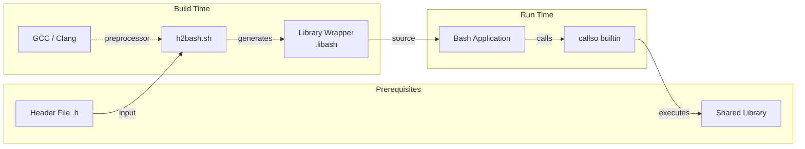

# bash-libcaller (linux, osx)


**Native, high-performance FFI for Bash.** Call C functions from shared libraries directly in your BASH 5.x scripts, without writing a single line of C glue code.

## TL;DR (Quick Start)

```bash
# 1. Build and (optional) install the bash builtin, be careful on OSX, we brew you some ;-)
make clean all && make install

# 2. Generate bindings (Linux example)
cd examples/raylib-linux && ./speedrun.bash && cd -

# (Or for macOS: cd examples/raylib-osx && ./speedrun.bash && cd -)

# 3. Run the demo game written in pure bash/raylib5.5
./examples/Bashout/run.sh
```

## The Concept

Traditionally, if you wanted to call a C function like `InitWindow` from Bash, you had two bad options:
1.  **Write a custom builtin**: Write C code to wrap `InitWindow`, handle argument parsing, compile it, and load it. Repeat for every single function.
2.  **Write a standalone binary**: Write a C program that calls the function, compile it, and run it from Bash. Slow (fork/exec overhead) and tedious.

**bash-libcaller** takes a different approach:

1.  **The Engine (`callso`)**: A single, generic Bash builtin. It uses `libffi` to dynamically construct function calls at runtime. It doesn't know about Raylib, libc, or OpenSSL. It just knows how to push arguments onto the stack based on a signature string.
2.  **The Generator (`h2bash.sh`)**: A script that parses C headers (using `gcc` itself for accuracy) and generates a **Bash script** containing the function signatures.

You run the generator once. It gives you a Bash file. You source that file. Now you have native Bash functions for the entire library.

## Performance Tuning

### Best Practices
1.  **Avoid Subshells:** Use `callso -v varname ...` instead of `var=$(callso ...)` in loops. Subshells fork, which kills performance.
2.  **Cache Signatures:** `callso` caches `dlsym` lookups and `ffi_cif` preparations. The first call is slow; subsequent calls are fast.

### Advanced: Custom libffi (Optional)
By default, `callso` builds against your system's `libffi`. This is fine for most use cases.
However, system builds often use generic trampolines which can be slower. For maximum performance (e.g. 60 FPS games on older hardware), you can build a custom optimized version:

1.  Download and build `libffi`:
    ```bash
    git clone https://github.com/libffi/libffi.git
    cd libffi
    ./autogen.sh
    ./configure --prefix=$HOME/.local/libffi-custom --disable-docs
    make -j$(nproc)
    make install
    ```
2.  Compile `callso` against it:
    ```bash
    export PKG_CONFIG_PATH=$HOME/.local/libffi-custom/lib/pkgconfig
    make clean && make
    ```

## Workflow



## How it works

### 1. The Generic Builtin
The `callso` builtin is the core. It accepts a library path, a signature, a function name, and arguments:

```bash
# Low-level usage (what the generated wrapper does)
# Signature format: "return_type arg1_type arg2_type ..."
callso "/usr/lib/libraylib.so" "void i32 i32 str" InitWindow 800 450 "Hello Bash"
```

### 2. The Binding Generator
Instead of manually writing those signatures, `h2bash.sh` automates it:

```bash
./tools/h2bash.sh /usr/include/raylib.h libraylib.so > raylib.bash
```

This generates a Bash script that looks like this:

```bash
declare -A RAYLIB_SIGS
RAYLIB_SIGS["InitWindow"]="void i32 i32 str"
RAYLIB_SIGS["CloseWindow"]="void"
# ... hundreds more ...

raylib() {
    # Wrapper that looks up the signature and calls the builtin
    local func=$1
    shift
    callso "$LIB_PATH" "${RAYLIB_SIGS[$func]}" "$func" "$@"
}
```

### 3. The User Experience
```bash
source raylib.bash

raylib InitWindow 800 450 "My Game"
while [[ $(raylib WindowShouldClose) != 1 ]]; do
    raylib BeginDrawing
    raylib ClearBackground 0xFFFFFFFF
    raylib DrawText "Hello from Bash!" 190 200 20 0xFFAAAAAA
    raylib EndDrawing
done
raylib CloseWindow
```

## Comparison: bash-libcaller vs ctypes.sh

[ctypes.sh](https://github.com/taviso/ctypes.sh) is the legendary pioneer of FFI in Bash. Here is how we differ:

| Feature | ctypes.sh | bash-libcaller |
| :--- | :--- | :--- |
| **Mechanism** | Uses `libffi` via a custom builtin (similar core concept). | Uses `libffi` via a custom builtin. |
| **Type Definition** | **Manual/Struct-based**. You define types and structs in Bash using a specific DSL (`struct MyStruct ...`). | **Header-driven**. We parse the C header files directly to generate signatures automatically. |
| **Philosophy** | "Write C in Bash." Great for complex pointer manipulation and struct handling. | "Call C from Bash." Optimized for calling functions with standard types (int, float, string, ptr) quickly and easily. |
| **Ease of Use** | Steep learning curve for the DSL. | Plug-and-play. Point it at a header, get a Bash function. |

**bash-libcaller** is designed for the "Speedrun" use case: I have a library, I want to call its functions *now*, and I don't want to manually define 500 function signatures.

## Building & Usage

### Requirements
- Linux or macOS
- `gcc` or `clang`
- `libffi` (dev headers required)
- Bash headers (usually `bash-builtins` or `bash-devel` package)

### 🍎 macOS Users: READ THIS FIRST
macOS ships with **Bash 3.2** (from 2007!), which is too old. This project requires **Bash 4.0+** because it uses associative arrays (`declare -A`).

1.  **Install a modern Bash**:
    ```bash
    brew install bash
    ```
2.  **Install dependencies**:
    ```bash
    brew install libffi
    ```
3.  **Run with the new Bash**:
    Do not use `/bin/bash`. Use the Homebrew version:
    ```bash
    /opt/homebrew/bin/bash ./examples/Bashout/run.sh
    ```

### 1. Build the Builtin
We provide a unified Makefile for both Linux and macOS.

```bash
make
```
This creates `lib/callso.so`.

### 2. Run the Example Game (Bashout)
We have a Breakout clone written entirely in Bash, using Raylib.

```bash
./examples/Bashout/run.sh
```
This script will:
1. Detect your OS.
2. Locate `callso.so`.
3. Locate or generate the Raylib bindings (`raylib.libash`).
4. Generate audio assets (procedural WAV files).
5. Launch the game.

### 3. Generate Bindings for Your Own Library
Use `h2bash.sh` to generate bindings for any C library.

```bash
# Usage: h2bash.sh <header> <libpath> [wrapper_name] [--prefix=PREFIX]
./tools/h2bash.sh /usr/include/raylib.h libraylib.so --prefix=RL > raylib.libash
```

Then in your script:
```bash
source raylib.libash
RL InitWindow 800 600 "My Window"
```

## Project Structure

- `src/`: C source code for the `callso` builtin.
- `tools/`: Helper scripts (`h2bash.sh`).
- `lib/`: Compiled output (`callso.so`).
- `examples/Bashout/`: The main demo game (platform agnostic).
- `examples/raylib-linux/`: Helper scripts to download/setup Raylib on Linux.
- `examples/raylib-osx/`: Helper scripts to download/setup Raylib on macOS.

## Zero-Install Usage
You don't need to install `callso` into your system Bash. You can just `enable -f ./lib/callso.so callso` in your script, as the examples do. This makes your Bash scripts portable (as long as the `.so` travels with them).


### Build (Manual)
```bash
make
```
This produces `callso.so`.

### Generate Bindings
```bash
# Syntax: ./tools/h2bash.sh <header> <library_name_or_path>
./tools/h2bash.sh /usr/include/raylib.h libraylib.so > raylib.libash
```

### Running & Installation

You have two options for using `callso`:

#### Option 1: Zero-Install (Local)
Just load the builtin from the current directory for a specific script. This is great for portable scripts or testing.
```bash
enable -f ./callso.so callso
source raylib.libash
```

#### Option 2: Permanent Installation
To make `callso` available in every Bash session (like a real plugin), add it to your `.bashrc` or `.bash_profile`:

```bash
# In your .bashrc
enable -f /absolute/path/to/bash-libcaller/callso.so callso
```

Now you can use `callso` in any script without enabling it manually. The generated scripts (like `Bashout.bash`) are smart enough to detect if `callso` is already loaded and will skip the local load.

### Usage Example
```bash
# Call functions!
raylib SetTargetFPS 60
```

## Current Status
- [x] Basic types (void, i32, u32, i64, u64, float, double, string/ptr)
- [x] Automatic signature generation
- [ ] Struct support (currently passed as pointers)
- [ ] Callback support (calling Bash functions from C)

## License
MIT

## Capabilities & Limitations

Since `callso` runs as a Bash builtin, it executes **inside** the Bash process. This means it shares memory with the shell, eliminating the need for IPC or Shared Memory (SHM) for most tasks.

| Feature | Status | Notes |
| :--- | :--- | :--- |
| **Scalars** (`int`, `float`, `bool`) | ✅ **Full** | Works natively. `bool` is treated as 1-byte integer. |
| **Structs** (`Vector2`, `Color`) | ✅ **Full** | Passed by value or pointer. Nested structs supported. |
| **Arrays** | ⚠️ **Partial** | You can pass pointers to arrays, but Bash has no native binary array type. You must manually `malloc` and populate buffers if creating them from Bash. |
| **Out-Parameters** (`int *count`) | ⚠️ **Manual** | Supported by passing a pointer to allocated memory, but reading the value back requires manual memory access/peeking. |
| **Callbacks** (`void (*func)(void)`) | ❌ **No** | You cannot pass a Bash function as a C function pointer. `libffi` closures are not yet implemented. |

**Note on Subshells:**
While `callso` is fast, standard Bash subshells `$(...)` are not. They fork a new process, which is slow and breaks memory sharing. Always use `callso -v varname ...` to retrieve values without forking.
